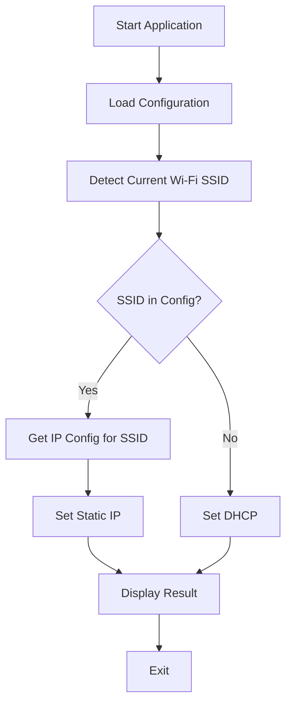
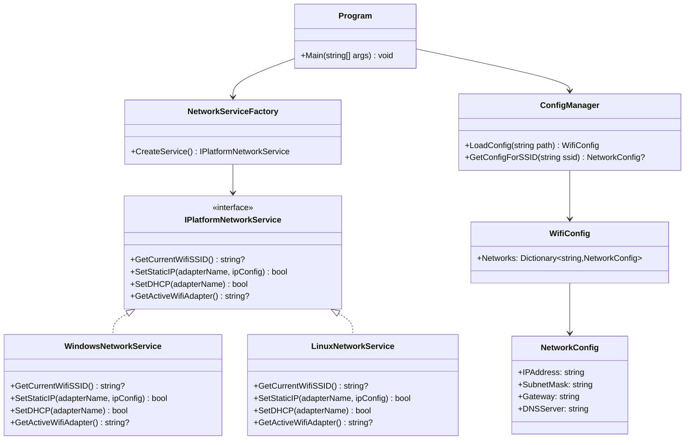

# Wi-Fi IP Management Tool - Architecture Plan

## Overview
A .NET 10.0 console application that automatically configures IP addresses based on the connected Wi-Fi network name (SSID). The tool detects the current Wi-Fi network and applies either a static IP (for known networks) or dynamic IP (DHCP) for unknown networks.

## Requirements Summary

### Functional Requirements
1. **Wi-Fi Detection**: Detect the currently connected Wi-Fi network name (SSID)
2. **Configuration Management**: Load Wi-Fi network configurations from a JSON file
3. **Static IP Assignment**: Set static IP, subnet mask, gateway, and DNS for known networks
4. **Dynamic IP Assignment**: Set DHCP for unknown networks
5. **Manual Execution**: Command-line tool that runs on-demand

### Network Configuration for Home WiFi
- **Wi-Fi Name**: Wifi47
- **Static IP**: 192.168.1.111
- **Subnet Mask**: 255.255.255.0
- **Default Gateway**: 192.168.1.1
- **DNS Server**: 192.168.1.1

## Architecture Design

### High-Level Flow



### Component Architecture



## File Structure

```
IPTool/
├── IPTool.csproj                      # Project file
├── Program.cs                         # Main application entry point
├── Models/
│   ├── NetworkConfig.cs               # Network configuration model
│   └── WifiConfig.cs                  # WiFi configuration model
├── Services/
│   ├── IPlatformNetworkService.cs     # Interface for platform-specific services
│   ├── NetworkServiceFactory.cs       # Factory to create platform-specific service
│   ├── WindowsNetworkService.cs       # Windows-specific network operations
│   ├── LinuxNetworkService.cs         # Linux-specific network operations
│   └── ConfigManager.cs               # Configuration management service
├── wifi-config.json                   # Configuration file (created at runtime)
└── README.md                          # User documentation
```

## Configuration File Format

### wifi-config.json
```json
{
  "networks": {
    "MyWifi": {
      "ipAddress": "192.168.1.111",
      "subnetMask": "255.255.255.0",
      "gateway": "192.168.1.1",
      "dnsServer": "192.168.1.1"
    }
  }
}
```

## Implementation Approach

### 1. Platform Detection
**Approach**: Use `System.Runtime.InteropServices.RuntimeInformation.IsOSPlatform()` to detect the operating system at runtime.

**Strategy**:
- Check for Windows first
- Check for Linux second
- Throw exception for unsupported platforms

### 2. Wi-Fi SSID Detection

#### Windows
**Approach**: Use `netsh wlan show interfaces` command.

**Command**:
```bash
netsh wlan show interfaces
```

**Parsing Strategy**:
- Execute command via `Process.Start()`
- Parse output to find "SSID" line
- Extract SSID value

#### Linux
**Approach**: Try `iwgetid -r` first, fallback to `nmcli -t -f active,ssid dev wifi`.

**Commands**:
```bash
iwgetid -r
# or
nmcli -t -f active,ssid dev wifi | grep '^yes:' | cut -d':' -f2
```

**Parsing Strategy**:
- Execute command via `Process.Start()`
- For `iwgetid`: Output is just the SSID
- For `nmcli`: Parse the output to extract SSID from active connection

### 3. Network Interface Discovery

#### Windows
**Approach**: Use `System.Net.NetworkInformation.NetworkInterface` class.

**Strategy**:
- Enumerate all network interfaces
- Filter for `NetworkInterfaceType.Wireless80211`
- Find the one with operational status `Up`
- Get interface name (e.g., "Wi-Fi")

#### Linux
**Approach**: Use `System.Net.NetworkInformation.NetworkInterface` combined with parsing `/sys/class/net/`.

**Strategy**:
- Enumerate all network interfaces
- Filter for `NetworkInterfaceType.Wireless80211`
- Find the one with operational status `Up`
- Get interface name (e.g., "wlp3s0", "wlan0")

### 4. Static IP Assignment

#### Windows
**Approach**: Use `netsh interface ip set address` command.

**Commands**:
```bash
netsh interface ip set address "Wi-Fi" static 192.168.1.111 255.255.255.0 192.168.1.1
netsh interface ip set dns "Wi-Fi" static 192.168.1.1
```

**Rationale**:
- Requires administrator privileges
- Reliable and well-documented
- Works consistently across Windows versions

#### Linux
**Approach**: Use `ip` command (part of iproute2 package).

**Commands**:
```bash
sudo ip addr add 192.168.1.111/255.255.255.0 dev wlp3s0
sudo ip route add default via 192.168.1.1 dev wlp3s0
# For DNS, update /etc/resolv.conf or use systemd-resolve
echo "nameserver 192.168.1.1" | sudo tee /etc/resolv.conf
```

**Alternative (NetworkManager)**:
```bash
sudo nmcli connection modify "Wifi47" ipv4.addresses 192.168.1.111/24
sudo nmcli connection modify "Wifi47" ipv4.gateway 192.168.1.1
sudo nmcli connection modify "Wifi47" ipv4.dns "192.168.1.1"
sudo nmcli connection modify "Wifi47" ipv4.method manual
sudo nmcli connection up "Wifi47"
```

**Rationale**:
- Requires root privileges (sudo)
- `ip` command is modern and widely available
- NetworkManager approach is more persistent

### 5. Dynamic IP Assignment

#### Windows
**Approach**: Use `netsh interface ip set address` with DHCP.

**Commands**:
```bash
netsh interface ip set address "Wi-Fi" dhcp
netsh interface ip set dns "Wi-Fi" dhcp
```

#### Linux
**Approach**: Use `dhclient` or NetworkManager.

**Commands**:
```bash
# Using dhclient
sudo dhclient -r wlp3s0
sudo dhclient wlp3s0

# Using NetworkManager (preferred)
sudo nmcli connection modify "Wifi47" ipv4.method auto
sudo nmcli connection up "Wifi47"
```

### 6. Configuration Management
**Approach**: Use `System.Text.Json` for JSON parsing.

**Rationale**:
- Built-in .NET library
- High performance
- Good error handling

## Error Handling Strategy

1. **Configuration Errors**
   - File not found: Create default config with home WiFi
   - Invalid JSON: Show error and exit
   - Missing required fields: Show error and exit

2. **Platform Detection Errors**
   - Unsupported OS: Show error and exit with list of supported platforms

3. **Network Detection Errors**
   - No Wi-Fi adapter found: Show error and exit
   - Not connected to Wi-Fi: Show error and exit
   - SSID detection failed: Show error and exit

4. **IP Configuration Errors**
   - Command execution failed: Show error details
   - Access denied (not admin/root): Prompt user to run with elevated privileges
   - Invalid IP address: Validate before applying
   - Command not found (Linux): Show installation instructions for required tools

5. **Platform-Specific Errors**
   - **Windows**: netsh command failures, interface not found
   - **Linux**: Missing tools (ip, iwgetid, nmcli), permission denied, NetworkManager not running

## Security Considerations

1. **Administrator Privileges**: Application must run as administrator to change network settings
2. **Configuration File**: Should be stored in application directory or user profile
3. **Input Validation**: Validate all IP addresses before applying

## User Experience

### Command-Line Interface (Windows)
```
IPTool v1.0 - Wi-Fi IP Configuration Tool
Platform: Windows

Detecting Wi-Fi network...
Connected to: Wifi47

Applying static IP configuration:
  IP Address: 192.168.1.111
  Subnet Mask: 255.255.255.0
  Gateway: 192.168.1.1
  DNS Server: 192.168.1.1

Configuration applied successfully!
```

### Command-Line Interface (Linux)
```
IPTool v1.0 - Wi-Fi IP Configuration Tool
Platform: Linux

Detecting Wi-Fi network...
Connected to: Wifi47

Applying static IP configuration:
  IP Address: 192.168.1.111
  Subnet Mask: 255.255.255.0
  Gateway: 192.168.1.1
  DNS Server: 192.168.1.1

Configuration applied successfully!
```

### Dynamic IP Example (Unknown Network)
```
IPTool v1.0 - Wi-Fi IP Configuration Tool
Platform: Windows

Detecting Wi-Fi network...
Connected to: CoffeeShopWiFi

Network not found in configuration. Applying DHCP...

Configuration applied successfully!
```

### Error Example (Windows)
```
IPTool v1.0 - Wi-Fi IP Configuration Tool
Platform: Windows

ERROR: No Wi-Fi adapter found or not connected to Wi-Fi.
Please ensure you are connected to a Wi-Fi network and run this application as administrator.
```

### Error Example (Linux)
```
IPTool v1.0 - Wi-Fi IP Configuration Tool
Platform: Linux

ERROR: Command 'iwgetid' not found.
Please install required tools:
  sudo apt-get install wireless-tools network-manager
Then run this application again with sudo.
```

## Testing Strategy

### Windows Testing
1. **Unit Tests** (optional, if time permits)
   - Configuration parsing
   - IP address validation
   - SSID parsing from netsh output

2. **Integration Tests**
   - Test with home WiFi (Wifi47) - should set static IP
   - Test with unknown WiFi network - should set DHCP
   - Test when not connected to WiFi
   - Test without administrator privileges
   - Test with multiple Wi-Fi adapters

### Linux Testing
1. **Unit Tests** (optional, if time permits)
   - Configuration parsing
   - IP address validation
   - SSID parsing from iwgetid/nmcli output

2. **Integration Tests**
   - Test with configured WiFi network - should set static IP
   - Test with unknown WiFi network - should set DHCP
   - Test when not connected to WiFi
   - Test without root privileges (sudo)
   - Test with NetworkManager available
   - Test without NetworkManager (using ip command)
   - Test on different Linux distributions (Ubuntu, Fedora, Arch)

## Dependencies

### Required NuGet Packages
- None (using built-in .NET libraries)

### System Requirements
- Windows 10 or later OR Linux (Ubuntu, Debian, Fedora, etc.)
- .NET 10.0 Runtime
- Administrator/root privileges

### Platform-Specific Requirements

#### Windows
- Built-in tools (netsh) - no additional installation required

#### Linux
- `ip` command (iproute2 package) - usually pre-installed
- `iwgetid` (wireless-tools package) - optional, for SSID detection
- `nmcli` (NetworkManager) - optional, for more reliable network management
- `dhclient` (isc-dhcp-client) - optional, for DHCP

**Installation commands for common Linux distributions**:
```bash
# Ubuntu/Debian
sudo apt-get install iproute2 wireless-tools network-manager isc-dhcp-client

# Fedora/RHEL
sudo dnf install iproute wireless-tools NetworkManager dhcp-client

# Arch Linux
sudo pacman -S iproute2 wireless_tools networkmanager dhclient
```

## Cross-Platform Support

The application will detect the operating system and use appropriate tools:

### Windows
- **Wi-Fi SSID Detection**: `netsh wlan show interfaces`
- **Static IP Assignment**: `netsh interface ip set address` and `netsh interface ip set dns`
- **Dynamic IP Assignment**: `netsh interface ip set address dhcp` and `netsh interface ip set dns dhcp`
- **Network Interface Discovery**: `System.Net.NetworkInformation.NetworkInterface`

### Linux
- **Wi-Fi SSID Detection**: `iwgetid -r` or `nmcli -t -f active,ssid dev wifi`
- **Static IP Assignment**: `ip addr add` and `ip route add`
- **Dynamic IP Assignment**: `dhclient` or `nmcli connection modify <connection> ipv4.method auto`
- **Network Interface Discovery**: `System.Net.NetworkInformation.NetworkInterface` + parsing `/sys/class/net/`

### Platform Detection
Use `System.Runtime.InteropServices.RuntimeInformation.IsOSPlatform()` to detect the OS:
```csharp
if (RuntimeInformation.IsOSPlatform(OSPlatform.Windows))
{
    // Use Windows-specific commands
}
else if (RuntimeInformation.IsOSPlatform(OSPlatform.Linux))
{
    // Use Linux-specific commands
}
```

## Future Enhancements (Optional)

1. Add command-line arguments for manual IP override
2. Add option to list all configured networks
3. Add option to add/remove network configurations
4. Create Windows service for automatic execution
5. Add logging to file for troubleshooting
6. Add GUI version for easier configuration management
7. Add macOS support (using networksetup command)
8. Add automatic execution on network connection change (event-based)

## Cross-Platform Architecture Benefits

1. **Code Reusability**: Core logic (configuration management, IP validation) is shared across platforms
2. **Maintainability**: Platform-specific code is isolated in separate service classes
3. **Extensibility**: Easy to add support for new platforms (e.g., macOS) by implementing the interface
4. **Testing**: Can mock the interface for unit testing
5. **Single Binary**: One compiled executable works on both Windows and Linux (via .NET's cross-platform runtime)

## Key Design Decisions

1. **Interface-Based Design**: Using `IPlatformNetworkService` interface allows for clean separation of platform-specific logic
2. **Factory Pattern**: `NetworkServiceFactory` handles platform detection and service instantiation
3. **Command Execution**: Using `Process.Start()` to execute shell commands is the most reliable cross-platform approach for network operations
4. **JSON Configuration**: Human-readable and easy to modify, works identically on all platforms
5. **Graceful Degradation**: On Linux, the tool tries multiple methods (nmcli, ip) and falls back gracefully

## Implementation Notes

1. **Configuration File Location**: Will be created in the application directory if it doesn't exist
2. **Interface Name**: The Wi-Fi interface name varies by platform:
   - Windows: "Wi-Fi", "Wireless Network Connection", etc.
   - Linux: "wlp3s0", "wlan0", "wlp2s0", etc.
   The tool will auto-detect it.
3. **Network Restart**: After changing IP settings, the network may need a moment to reconnect
4. **Multiple Wi-Fi Adapters**: The tool will use the first active Wi-Fi adapter found
5. **Privilege Requirements**:
   - Windows: Must run as Administrator
   - Linux: Must run with sudo (root privileges)
6. **Linux Network Management**: The tool will prefer NetworkManager (nmcli) if available, as it provides more persistent configuration. Falls back to ip command if NetworkManager is not available.
7. **DNS Configuration on Linux**: DNS configuration can be tricky on Linux due to systemd-resolved and other DNS resolvers. The tool will attempt to update /etc/resolv.conf, but users may need to adjust their system's DNS resolver configuration.
8. **Cross-Platform Compatibility**: The application uses .NET 10.0 which supports both Windows and Linux natively. No platform-specific compilation is needed.
